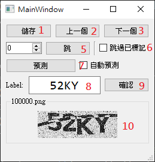

# captcha-labeling-tool
###### tags: `python3` `captcha``labeling-tool` `qt5` `gui` `pyside2`

## Introduction

本專案為[THSR-captcha-solver](https://github.com/y252328/THSR-captcha-solver)的子專案，用pysides來實作一個驗證碼標記工具。
由於前述專案的準確率已經達預期，所以未來不打算更新。

## Requirements
python==3.6
PySide2==5.13.2

## Usage

1. 將暫存的標記寫入檔案
2. 上一張圖，勾選跳過已標記時會跳到前一張未標記的圖
3. 下一張圖，勾選跳過已標記時會跳到下一張未標記的圖
5. 尚未實作
6. 上一下或下一張時跳過已標記的圖
7. 尚未實作
8. label編輯欄，詳細操作參考下面
9. 將8.label暫存起來並往下一張
10. 驗證碼圖片

### label編輯欄
在編輯欄時按上下鍵可切換圖片(等同2&3按鈕)
按enter鍵暫存label並往下一張(等同9按鈕)

## Notic
* 使用前請先將main.py中的self.dir改為dataset的目錄
* 若未按enter或確認將不會暫存或儲存編輯的結果
* 要按儲存鈕才會寫入檔案
